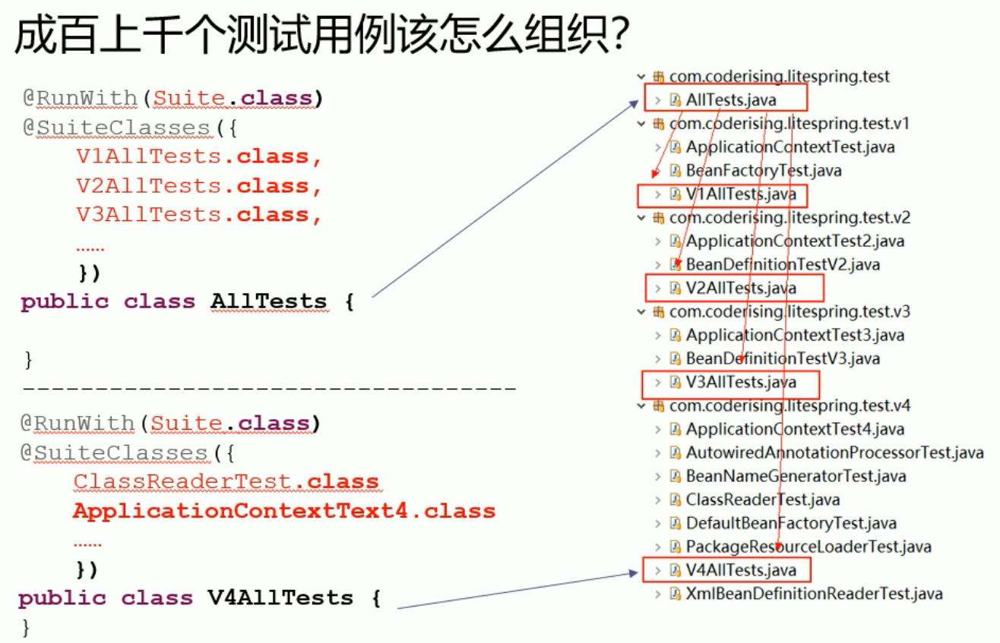
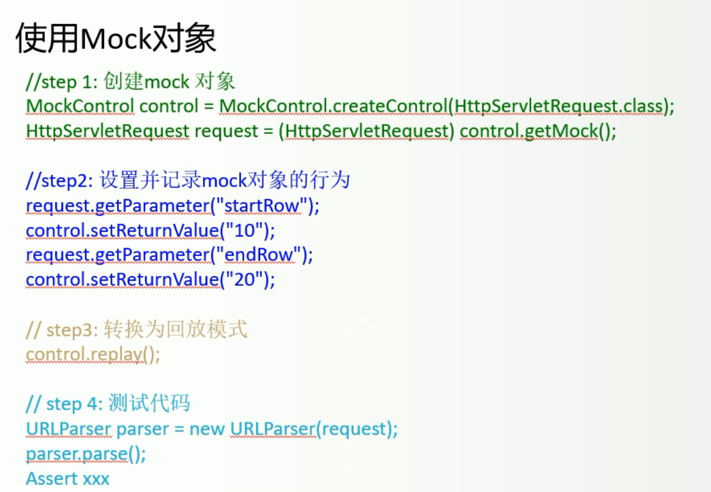
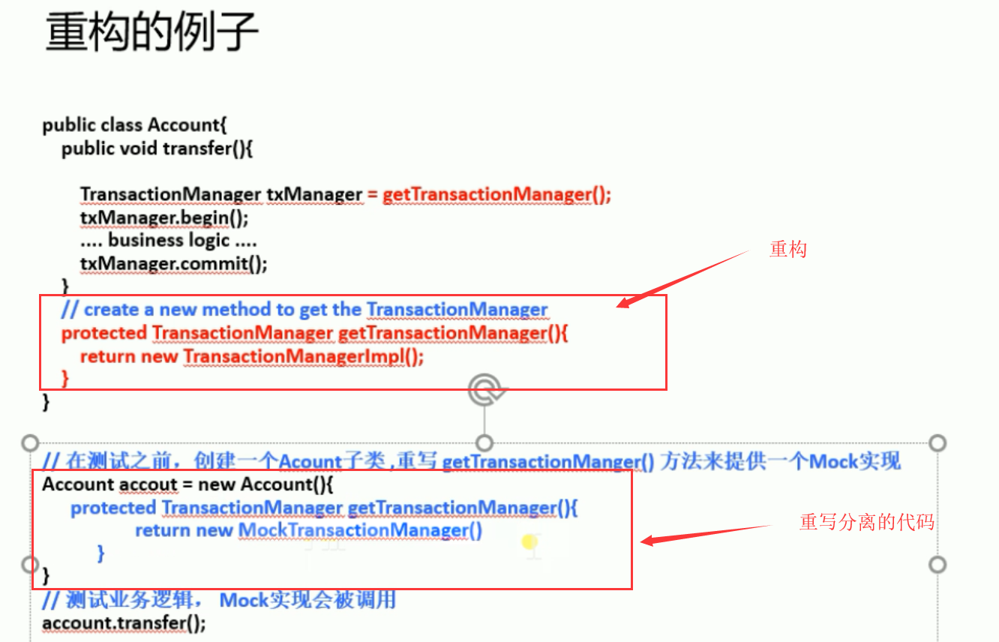
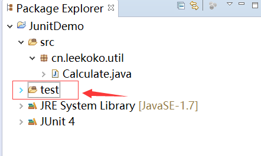
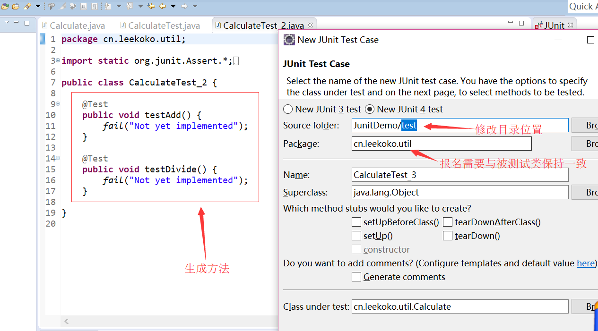

# Junit      

## Junit概述

### 什么是单元测试

测试分白盒测试和黑盒测试

- 白盒测试：像开发人员很清楚程序内部逻辑，对程序做的测试叫做白盒测试，单元测试是开发人员编写的小段代码，属于白盒测试，最受益的是开发人员。
- 黑盒测试：测试人员，不知道代码逻辑，直接从暴露的功能上进行的测试。就像对黑盒子进行测试。

### 单元测试的优势

类可以直接用main方法进行调用运行来测试，为什么非要用到Junit？

因为一个类中有很多个方法，而main只能对应一个方法进行测试。

而Junit则可以写多个测试方法，通过``Suite.class``可以将各个测试类组织起来，形成一个树状结构。

Junit还可以使用类似``Assert.assertEquals(52,result);``自动判断实际值和期待值是否一样，不用人为进行判断。


loading


  

M：为什么单元测试那么重要？

Z：单元测试相当于文档的作用，让我们从使用者的角度来看代码，所以单元测试需要随着代码同步维护。

### 断言  

M：检查结果对不对的代码还有哪些？

Z：在Junit中叫做断言，常用的断言有：

1. ``Assert.assertEquals(expected,actual);``  判断值/对象是否相同   
2. ``Assert.assertTrue(condition);``   判断值是否为true  
3. ``Assert.assertNotNull(object);``  判断对象是否非空   
4. ``Assert.assertArrayEquals(expecteds,actuals);``  判断数组是否相等   

Z：有一些异常是必须要出现的，如果输入一些非法值，而程序不出现异常，继续运行下去则可能会破坏数据。所以还有一种测试是测试，输入非法值的时候，程序是否会抛出异常。

这种测试就是简单的try{}catch{}语句，然后在后面添加``Assert.fail()``语句，表示如果顺利跑到该位置（捕捉不到异常），Junit直接报错。   

### 注解  

M：除了``@Test``,还有``@Before``&``@After``,它们是干嘛用的？

Z：调用每个``@Tets``的方法时候， 都会在其测试方法前后执行。   

M：``BeforeClass``&``AfterClass``和``@Before``&``@After``之间有什么区别？

Z：``@Before``&``@After``是相对于一个方法的前后，而``BeforeClass``&``AfterClass``是相对于整个类的前后。

M：``BeforeClass``&``AfterClass``一般用在什么情况下呢？

Z：``BeforeClass``在方法调用前执行。是静态的，适合加载配置文件

​	``AfterClass``所有方法执行后执行，用来资源清理，如关闭数据库连接  

### Mock对象

M：Mock对象有什么作用？

Z：有些对象难以构造，可能依赖于某些容器。像HttpServlet只在Tomcat中等。而Mock就是模拟出这些对象，替代对象来保证被测试方法的正常运行。     

M：有什么使用Demo呢？

Z： 以下为暂时的图片，后期实际编码的时候再替换代码!!!!!!!!!!!!!!!!!!!loading

  

M：实际使用场景有吗？

Z： 以下为暂时的图片，后期实际编码的时候再替换代码!!!!!!!!!!!!!!!!!!!!loading 

   

刘欣：强烈推荐书《修改代码的艺术》

### Junit的使用规范  

一般我们测试类是放在一个新的文件夹里面，一旦项目完成，直接删除并且不会影响项目本身。  

1. 所以现在项目下新建一个test文件夹   

    

2. 然后右键项目--新建Junit Test Case，修改类的目录位置为test，点击next，选择要测试的方法名打勾，点击finish就能自动生成测试方法。  

    

3. 这里还有一些命名上的规范  

测试对象：类名Calculate    方法名add

测试类：类名CalculateTest  方法名testAdd   

类名后面添加Test，方法名前面添加test   

### Junit的Demo  

M：有没有相关的使用Demo流程呢？

Z：

1. pom中添加依赖

   ```xml
   	    <dependency>
   	        <groupId>org.mockito</groupId>
   	        <artifactId>mockito-all</artifactId>
   	        <version>2.0.2-beta</version>
   	    </dependency>
   ```

2. junit中引入静态包方法``import static org.mockito.Mockito.*;``   

3. 简单案例

   ```java
   	@Test
   	public void testInitCurYear(){
           /* 创建 Mock 对象 */
           List list = mock(List.class);
           /* 设置预期，当调用 get(0) 方法时返回 "111" */
           when(list.get(0)).thenReturn("111");

           Assert.assertEquals("asd", 1, 1);
           /* 设置后返回期望的结果 */
           System.out.println(list.get(0));
           /* 没有设置则返回 null */
           System.out.println(list.get(1));

           /* 验证返回结果 */
           String ret = (String)list.get(0);
           Assert.assertEquals(ret, "111");
   		
   	}
   ```

   ​

