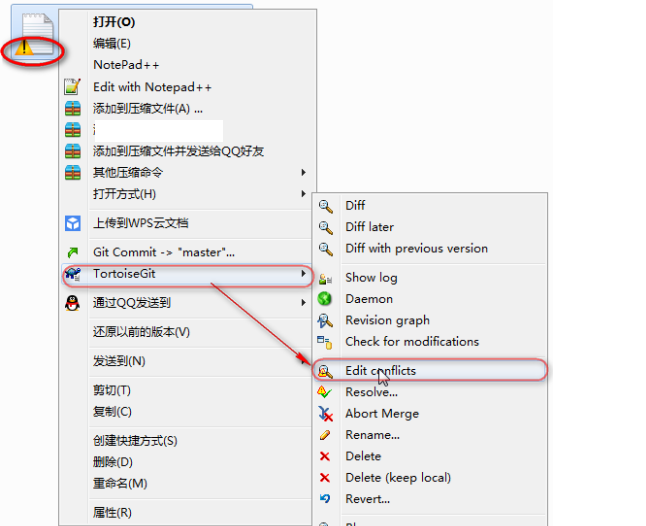

# Git

### 分支

M：Git怎么提交到分支上？

Z：commit的时候选择new branch，添加新分支名称。

M：Git怎么合并分支的内容？

Z：切换到master主干，通过Merge可以将指定分支的内容合并到主干上，提交即可。

M：Git怎么删除分支？

Z：命令为：``git push origin :<branchName>``  

### 冲突

M：当遇到冲突的代码时，怎么解决？

Z：操作如下

1. 右键冲突文件tortoiseGit --> Edit conflict

     

2. 将合并的结果数据添加到Meged中

      

3. 标记冲突解决

     

	

  

   

