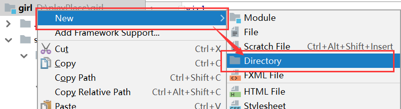
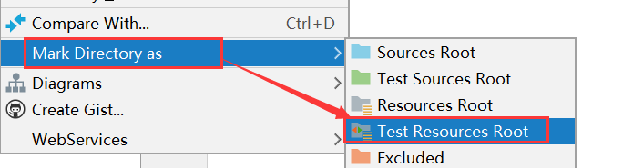
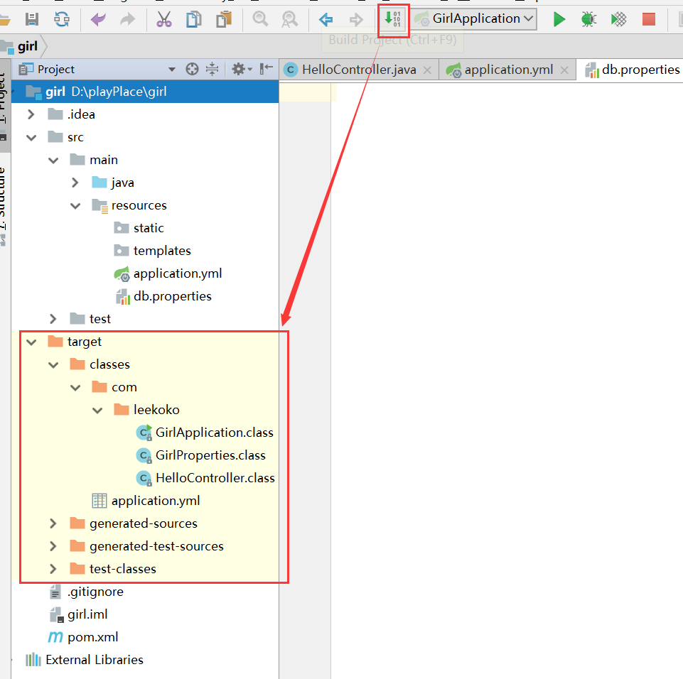
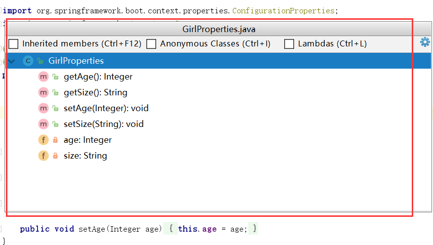
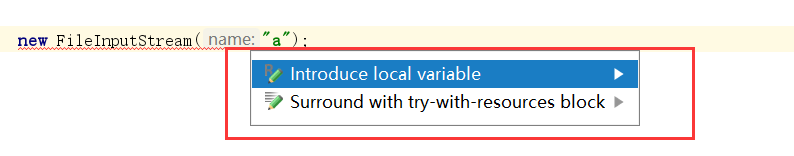
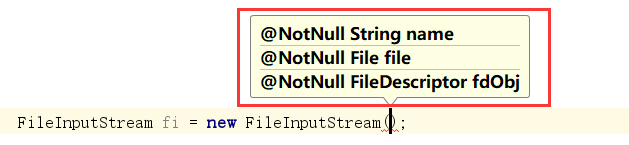
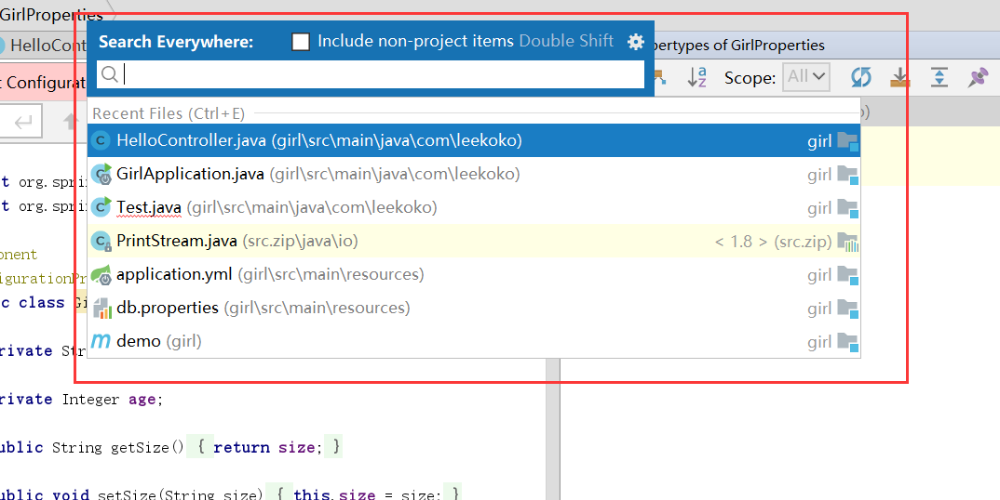
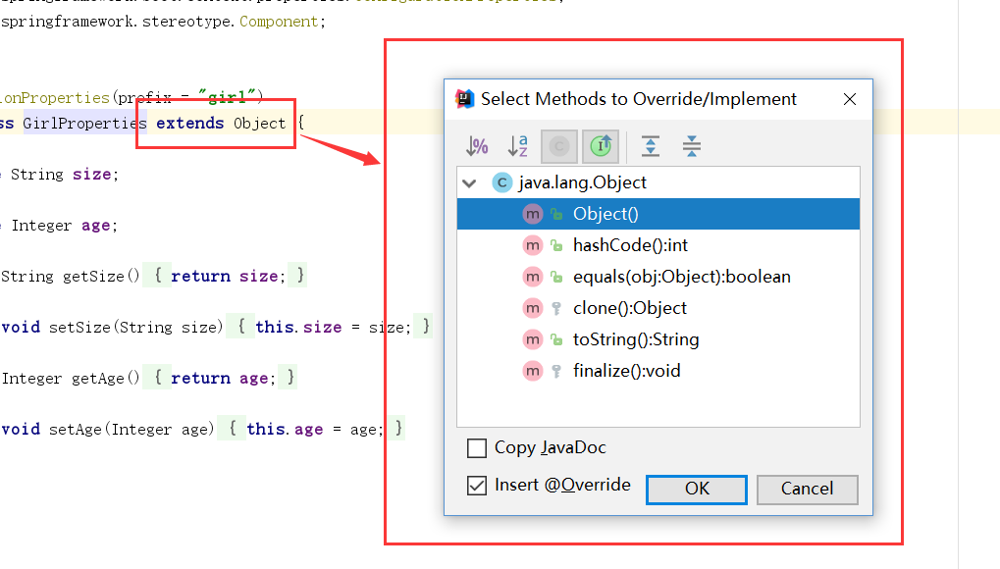
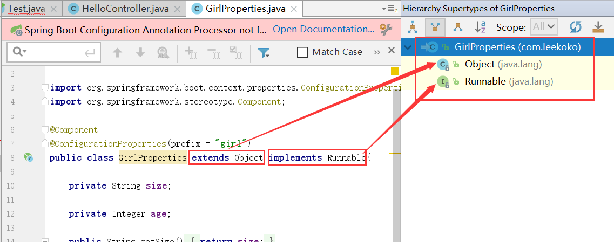

# IDEA  

D：idea是更加快捷的编辑器，今天我们来熟悉一下idea的简单使用。

### 基础操作   

#### 创建特殊文件夹  

M：在idea中怎么创建资源文件夹？

Z：右键新建文件夹

  

另外还要将普通文件夹指定为资源文件夹才会被编译

#### 编译  

M：idea怎么进行编译呢？

Z：点击编译按钮，target中的红色文件夹中就是编译后的文件，一般运行的时候会自动编译。

  

### 快捷键   

#### 旧的快捷键

Z：关于快捷键的使用，可以阅读[官方文档](ideaKeyMap.pdf) 。也可以按**Ctrl+Shift+A ** 进行搜索执行（要求熟悉英文名）。   

M：像eclipse的上下移动单行代码快捷键是？

Z：Ctrl + shift + ↑/↓   

M：快速复制/删除行的快捷键是？

Z：Ctrl+D复制，Ctrl+Y粘贴    

M：搜索的快捷键呢？

Z：Ctrl+F，搜索并替换的快捷键是Ctrl+R   

M：怎么在打开的项目的项目之间切换

Z：Alt+←/→ ，前进后退导航Ctrl + Alt + ←/→   

M：怎么全局搜索呢？

Z：Ctrl + N搜索文件，Ctrl + Shift + N搜索文件夹，Alt+F7(+Fn)搜索文字，Ctrl + Shift + F搜索文字并显示代码详情。

M：为什么我按Ctrl + Shift + F搜索不到？

Z：可能是和搜狗输入法等其他快捷键冲突了，设置一下即可。

M：set get的快捷键是？

Z：Alt+Insert   

M：要进行重构重命名，快捷键是？

Z：Shift+F6 (+Fn) 

M：重构提取方法呢？

Z：Ctrl+Alt+M

M：如何运行或者调试呢？

Z：运行Shift+F10，调试Shift+F9

M：断点调试的时候用到的快捷键

Z：进入F7 (+Fn) ，跨出F8 (+Fn) 

M：有什么快捷补全的代码？

Z：main方法psvm，输出代码sout，可以写成 "输出语句的内容".sout  (string字符串+.sout)的形式。  

M：那for循环怎么编写呢？

Z：使用**arr.fori**就可以直接生成一段for循环代码。foreach的循环用**arr.iter**   

M：去除，导入包的快捷键是？

Z：Ctrl + Alt + O

#### 新的快捷键

D：下面是新的，实用的快捷键

M：有全屏编辑模式的快捷键吗？

Z：Ctrl+ shift + F12  (+Fn) 

M：在类中的方法之间切换的快捷键？

Z：Ctrl + F12(+Fn)

  

M：听说idea有UML图，怎么显示出来呢？

Z：Ctrl+Alt+U

M：想要复制文件的快捷键呢？

Z：F5(+Fn)，也有移动，是F6(+Fn)   

Z：这里介绍一个快捷重构的方法列表Ctrl + Shift +Alt + T，里面还可以将当前类重构出继承的接口出来。   

M：当发现红色标识报错的时候，怎么办？

Z：当缺少包或局部变量，按 Alt + Enter 再按回车即可实现智能修复。

  

M：定位错误的快捷键怎么用？

Z：F2(+Fn)，上一个用Shift + F2(+Fn)    

M：一些明显的语法错误有快捷键处理吗？

Z：Ctrl + Shift + 回车   

M：如果我要查看某个接口被怎么实现了，有快捷键吗？

Z：Ctrl + Shift + B即可查看实现的类列表   

M：我在写代码的时候，某个参数不知道填什么类型的，可以使用什么快捷键？

Z：Ctrl + P可以显示参数信息进行提示

  

M：要搜索所有的文件，使用什么快捷键？  

Z：双击Shift

  

#### 少用的快捷键

D：下面是比较少用的快捷键。

M：上下事件的快捷键？

Z：上事件F3  (+Fn) ，下事件Shift+F3   (+Fn) 

M：怎么查看最近打开的文件呢？

Z：Ctrl + E   

M：要怎么快速选择代码呢？

Z：基于语法选择使用Ctrl + W，要缩小选择范围Ctrl + Shift + W    

M：有大小写转化的快捷键是？

Z：Ctrl + Shift + U

M：快速格式化代码的快捷键？

Z：Ctrl + Alt + L   

M：实现方法的快捷键是？

Z：Ctrl + I 

M：重写方法的快捷键是？

Z：Ctrl + O  

  

M：怎么查看类的继承，实现关系？

Z：用快捷键Ctrl + H   

   

https://ke.qq.com/webcourse/index.html#cid=298348&term_id=100353592&taid=2009765521952108&vid=k142641lyc5

---

https://ke.qq.com/course/298348

http://edu.51cto.com/course/13866.html?source=so

https://ke.qq.com/course/297923

https://www.imooc.com/video/16216一大堆快捷键

https://ke.qq.com/course/320065