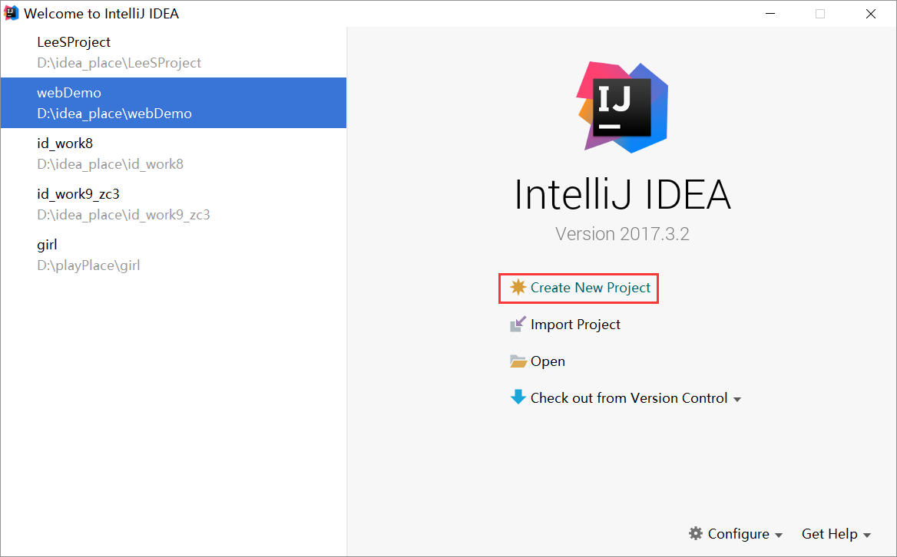
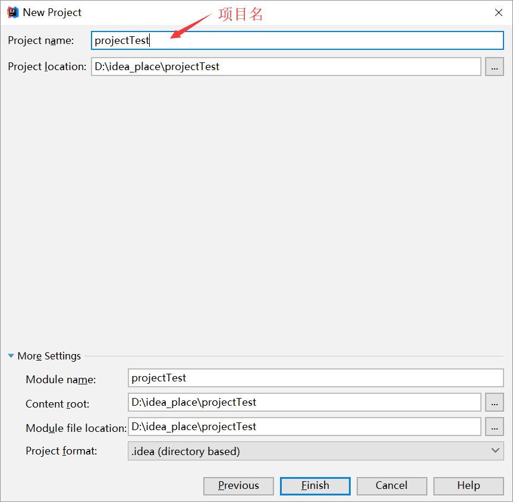
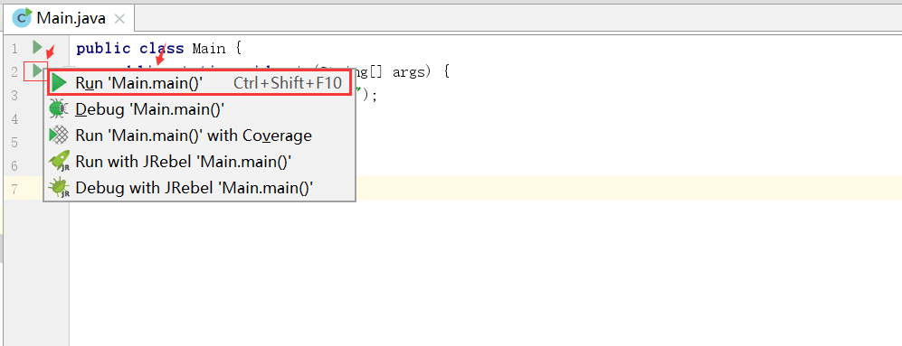
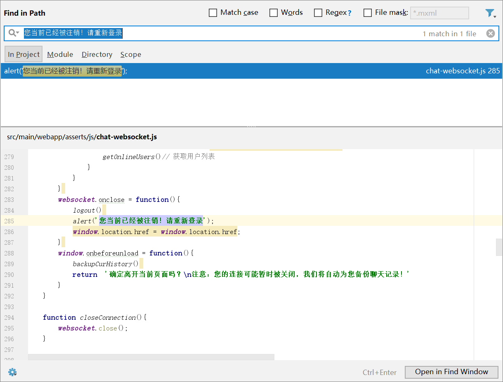
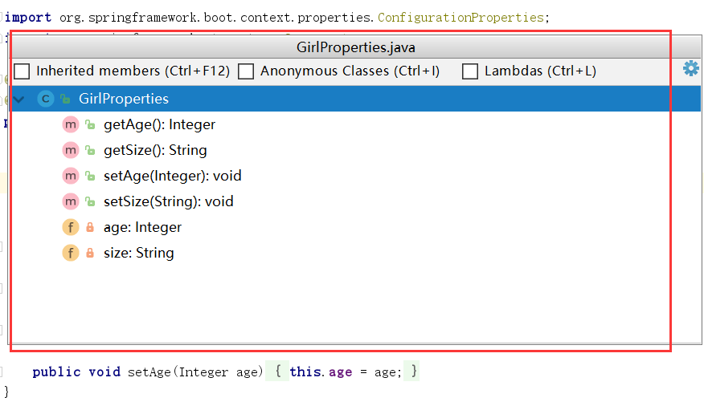
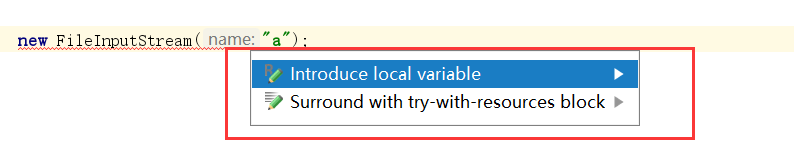
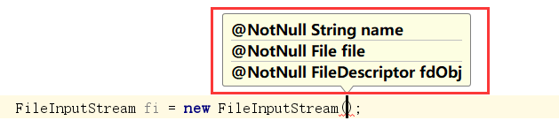
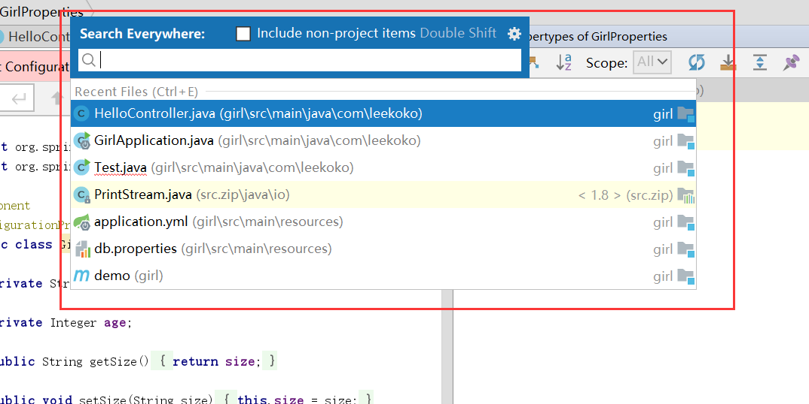
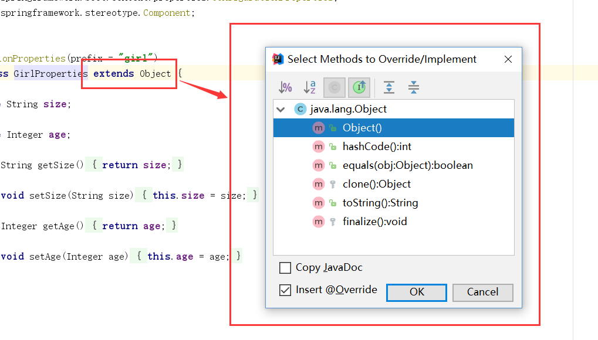
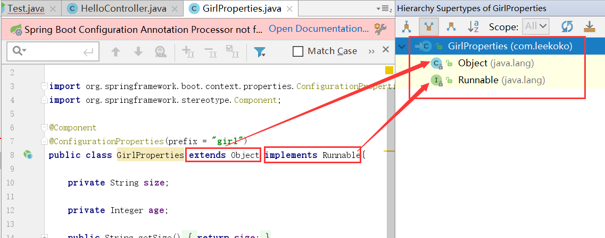

# IDEA（上）  

本文主要讲idea项目的创建，运行。还有idea常用的快捷键。

## 1.创建项目

#### 创建Java项目  

Z：Create New Project，一路next  

  

  

M：编写完java代码，怎么运行呢？

Z：点击右边的开始按钮，选择运行项目main方法

  

M：idea怎么进行编译呢？

Z：点击编译按钮，target中的红色文件夹中就是编译后的文件，一般运行的时候会自动编译。

  

#### 创建Web项目

Z：创建Web项目使用Java Enterprise，同时对Tomcat的路径进行配置  

  

选择Web Application   

  

M：在idea中怎么创建资源文件夹？

Z：右键新建文件夹

  

另外还要将普通文件夹指定为资源文件夹才会被编译


#### 创建maven的jar项目   

Z：要创建maven的jar项目，选择maven之后直接next   


填入项目名和位置，点击next      

  

#### 创建maven的war项目      

Z：要创建maven的war项目，选择Maven，打勾通过原型创建，选择webapp

  

输入项目名，地址点击下一步

   

  

Z：这里要将欠缺的文件夹（java，resource）补全，并且将其设置为Sources Root和Resources Root具有功能的文件夹（转化之后才能往里面添加class和xml文件）   


## 2.部署项目

M：新建完Web项目之后怎么启动呢？  

Z：配置tomcat

1. 通过配置Tomcat启动，选择Edit Configurations

   

2. 配置Local的Tomcat

   

3. 填写tomcat名，配置tomcat位置

4. 点击加号+，选择Artifact..

     

   添加已解释的war包

     

5. 运行tomcat即可进行访问

       

Z：也可以通过插件的方式启动

1. pom.xml添加tomcat配置

   ```xml
     <!--配置插件-->
     <build>
       <plugins>
         <plugin>
           <groupId>org.apache.tomcat.maven</groupId>
           <artifactId>tomcat7-maven-plugin</artifactId>
           <configuration>
             <path>/</path>
             <port>8080</port>
           </configuration>
         </plugin>
       </plugins>
     </build>
   ```

2. 添加Maven，填入运行指令则配置好插件tomcat

     

3. 同样方式点击即可运行。   

     


## 2.常见快捷键  

#### 1. 跟eclipse不同的快捷键

Z：关于快捷键的使用，可以阅读[官方文档](ideaKeyMap.pdf) 。也可以按**Ctrl+Shift+A ** 进行搜索执行（要求熟悉英文名）。   

M：像eclipse的上下移动单行代码快捷键是？

Z：Ctrl + shift + ↑/↓   

M：快速复制/删除行的快捷键是？

Z：Ctrl+D复制，Ctrl+Y粘贴    

M：搜索的快捷键呢？

Z：Ctrl+F，搜索并替换的快捷键是Ctrl+R   

M：怎么在打开的项目的项目之间切换

Z：Alt+←/→ ，前进后退导航Ctrl + Alt + ←/→   

M：怎么全局搜索文字呢？

Z：Ctrl + Shift + F搜索文字并显示代码详情。

  

M：为什么我按Ctrl + Shift + F搜索不到？

Z：可能是和搜狗输入法等其他快捷键冲突了，设置一下即可。

M：set get的快捷键是？

Z：Alt+Insert   

M：要进行重构重命名，快捷键是？

Z：Shift+F6 (+Fn) 

M：重构提取方法呢？

Z：Ctrl+Alt+M

M：如何运行或者调试呢？

Z：运行Shift+F10，调试Shift+F9

M：断点调试的时候用到的快捷键

Z：进入F7 (+Fn) ，跨出F8 (+Fn) 

M：有什么快捷补全的代码？

Z：main方法psvm，输出代码sout，可以写成 "输出语句的内容".sout  (string字符串+.sout)的形式。  

M：那for循环怎么编写呢？

Z：使用**arr.fori**就可以直接生成一段for循环代码。foreach的循环用**arr.iter**   

M：去除，导入包的快捷键是？

Z：Ctrl + Alt + O

#### 2. 新的好用快捷键

D：下面是新的，实用的快捷键

M：有全屏编辑模式的快捷键吗？

Z：Ctrl+ shift + F12  (+Fn) 

M：在类中的方法之间切换的快捷键？

Z：Ctrl + F12(+Fn)

  

M：听说idea有UML图，怎么显示出来呢？

Z：Ctrl+Alt+U

M：想要复制文件的快捷键呢？

Z：F5(+Fn)，也有移动，是F6(+Fn)   

Z：这里介绍一个快捷重构的方法列表Ctrl + Shift +Alt + T，里面还可以将当前类重构出继承的接口出来。   

M：当发现红色标识报错的时候，怎么办？

Z：当缺少包或局部变量，按 Alt + Enter 再按回车即可实现智能修复。

  

M：定位错误的快捷键怎么用？

Z：F2(+Fn)，上一个用Shift + F2(+Fn)    

M：一些明显的语法错误有快捷键处理吗？

Z：Ctrl + Shift + 回车   

M：如果我要查看某个接口被怎么实现了，有快捷键吗？

Z：Ctrl + Shift + B即可查看实现的类列表   

M：我在写代码的时候，某个参数不知道填什么类型的，可以使用什么快捷键？

Z：Ctrl + P可以显示参数信息进行提示

  

M：要搜索所有的文件，使用什么快捷键？  

Z：双击Shift  

  

#### 3.少用的快捷键

D：下面是比较少用的快捷键。

M：上下事件的快捷键？

Z：上事件F3  (+Fn) ，下事件Shift+F3   (+Fn) 

M：怎么查看最近打开的文件呢？

Z：Ctrl + E   

M：要怎么快速选择代码呢？

Z：基于语法选择使用Ctrl + W，要缩小选择范围Ctrl + Shift + W    

M：有大小写转化的快捷键是？

Z：Ctrl + Shift + U

M：快速格式化代码的快捷键？

Z：Ctrl + Alt + L   

M：实现方法的快捷键是？

Z：Ctrl + I 

M：重写方法的快捷键是？

Z：Ctrl + O  

  

M：怎么查看类的继承，实现关系？

Z：用快捷键Ctrl + H   

   
