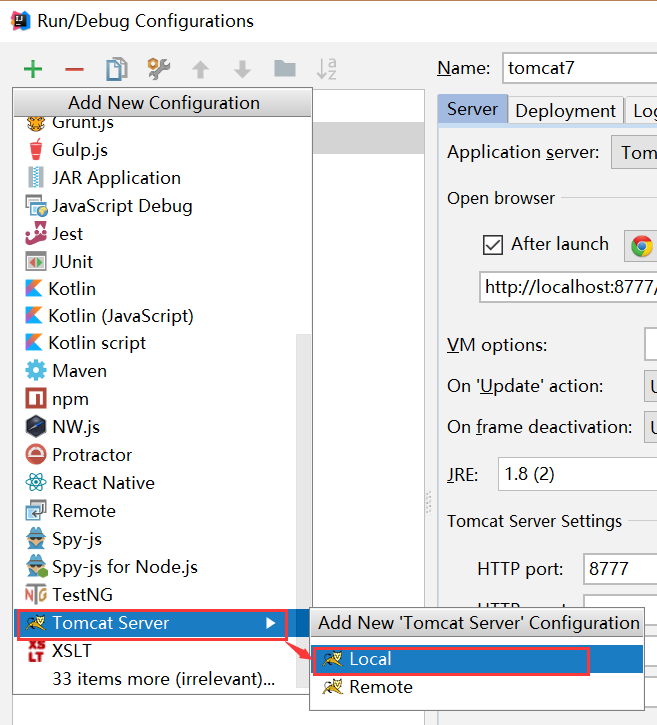
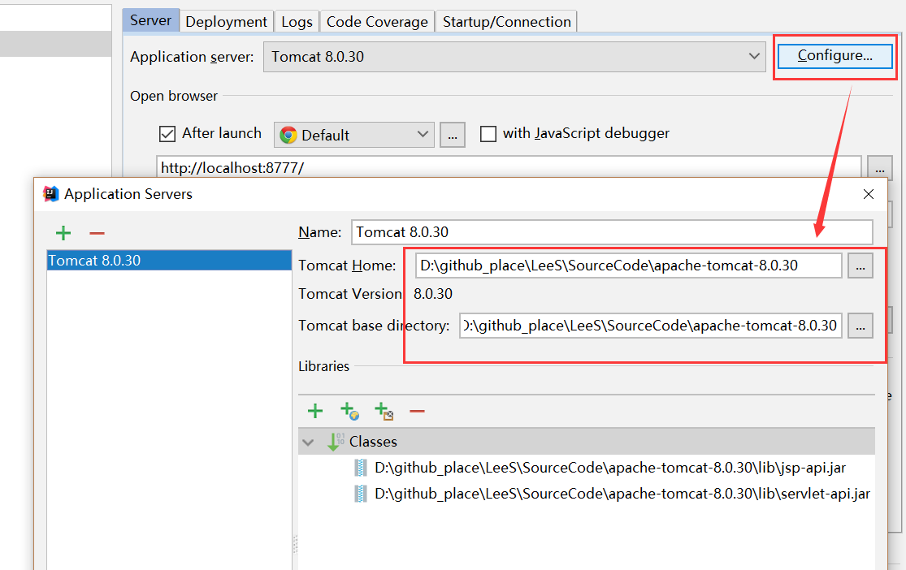
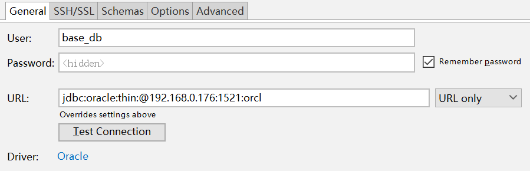

# IDEA（中）

## 分布式项目创建

Z：复杂项目创建步骤，首先创建目录结构   

1. 创建空项目，作为顶级文件夹   

     

2. 创建聚合项目

     

     

   填写项目名，点击完成即可。

3. 往聚合项目中创建Module   

   

     

     

     

   创建后目录如下

     

4. 因为以上创建的项目都不用于编译，所以可以把src文件夹删除   

Z：在聚合项目中创建pom工程  

1. 也是使用New - Module，创建父工程，设置Parent为none  

     

    

   往pom.xml中添加package``<packaging>pom</packaging>``    

2. 同理创建继承模块，继承于Parent，其属于basic项目      

      

   获得以下目录结构

     

3. install安装pom工程项目到仓库


Z：创建war项目   

1. 创建module，继承于Parent

       

2. 修改路径位置  

     


## 热部署

M：当修改一些参数，不想重启服务器，应该怎么做？

Z：可以配置tomcat热部署。

  

修改了内容之后，将焦点挪出编辑框，即执行热部署。

  

M：但是这种配置对新增新成员（例如参数，方法）是不起效果的。

D：那只能重启服务器，否则就是使用**JRebel插件**。  

M：怎么离线安装JRebel插件呢？

Z：点击设置，选择插件并导入即可  

  

JRebel下载地址：链接：https://pan.baidu.com/s/10Vlu2NJU-7TS7mpD_Jf65Q 密码：5imr   

（_这个软件是收费的，建议进行购买，学习用途可以参照该[网友](https://blog.csdn.net/qq_27093465/article/details/79148498)写的文章进行激活。_)  

M：怎么使用热部署的方式配置启动tomcat呢？

Z：方法和普通tomcat部署没有太大区别

1. 添加本地tomcat

       

2. 配置tomcat地址   

     

3. 添加war项目需要选择war exploded  

   

4. 注意选择Update classes and resources

     

5. 选择对应tomcat，点击JRebel 的Debug即可(JRebel启动比较慢)    

     

M：我启动之后报错，``HTTP Status 500 - Request processing failed; nested exception is org.apache.ibatis.binding.BindingException: Invalid bound statement (not found): cn.leekoko.mapper.OnlinecontentMapper.selectByExample``是怎么回事呢？

Z：新版IntelliJ IDEA不会自动编译source folder下的xml文件，如果要实现编译，需要在其pom.xml中添加以下代码

  

```xml
	<!-- 如果不添加此节点mybatis的mapper.xml文件都会被漏掉。 -->
	<build>
		<resources>
            <resource>
                <directory>src/main/java</directory>
                <includes>
                    <include>**/*.properties</include>
                    <include>**/*.xml</include>
                </includes>
                <filtering>false</filtering>
            </resource>
        </resources>
	</build>
```

M：我部署之后，放在webapp下的静态资源访问不到，怎么办？

Z：在发布项目的时候，静态资源也要指定发布，并且添加访问路径

  

## idea管理数据库   

M：idea怎么添加管理数据库呢？

Z：直接添加即可

      


------

免费视频资料：

https://ke.qq.com/course/298348

http://edu.51cto.com/course/13866.html?source=so  

https://ke.qq.com/course/297923

https://www.imooc.com/video/16216

https://ke.qq.com/course/320065


