# Kettle实现数据迁移   

下载地址：http://mirror.bit.edu.cn/pentaho/Data%20Integration/

（JDK1.8才可支持Kettle7.0以后的版本）  

### 配置环境变量，启动程序    

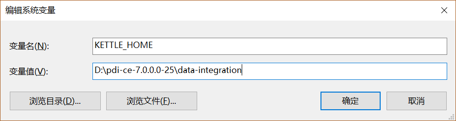  

(变量值根据文件目录而定)   

运行Spoon.bat启动程序   

### 单表数据迁移   

1. 进入主界面，左上角点击**文件-新建-转换**保存为demo.ktr

2. 左侧选择**核心对象**面板。”在**输入**文件夹下选择**表输入**并把它拖动到右侧编辑区。    

   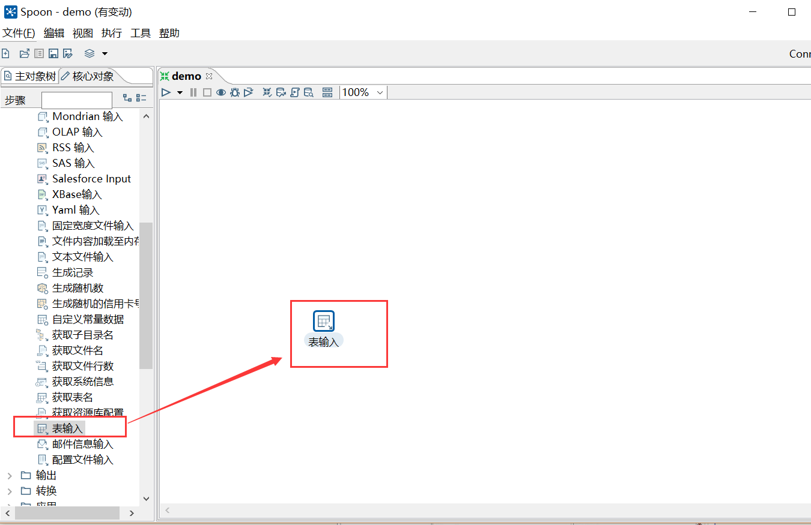  

3. 双击编辑区的**表输入**图标，编辑数据输入来源。点击**数据库连接**右侧的**新建**按钮，按demo背景中的要求，配置数据库参数。配置后点击**测试**   

   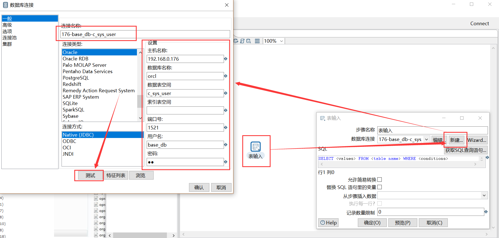  

   _如果报错找不到驱动包，复制oracle的驱动jar文件到ETL(Kettle)的lib目录下（我这里使用的是jdbc7.jar）_   

4. 点击**获取SQL查询语句**”（等待时间较长），选择要迁移的表，点击**确定**

   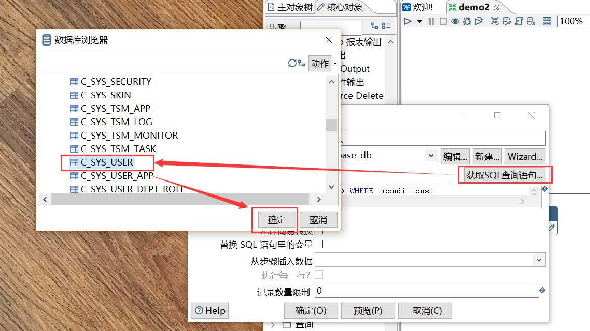  

   选择**否**

   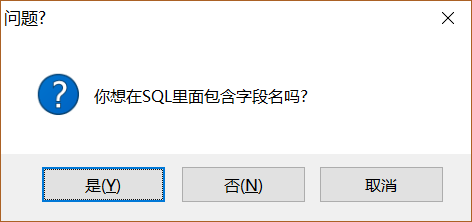  

5. 重复以上步骤2，在**输出**文件夹下选择**表输出**并把它拖动到右侧编辑区。连线**表输入**和**表输出**  

   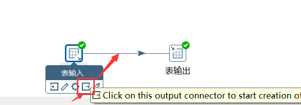  

   ​

6. 双击编辑表输出，填入目标表名    

   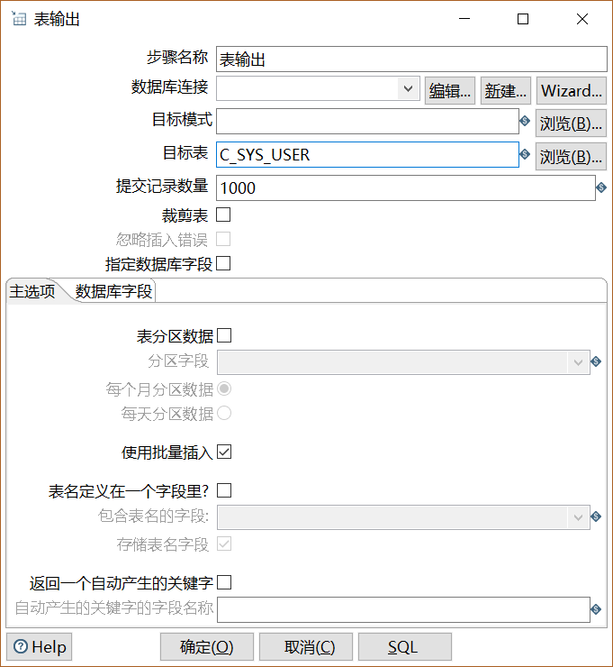  

   _要迁移的目标表不能已存在于目标数据库中，除非是表结构相同。_   

7. 点击 执行SQL 语句列表，选择**执行SQL** (已有数据库无需此步骤)     

   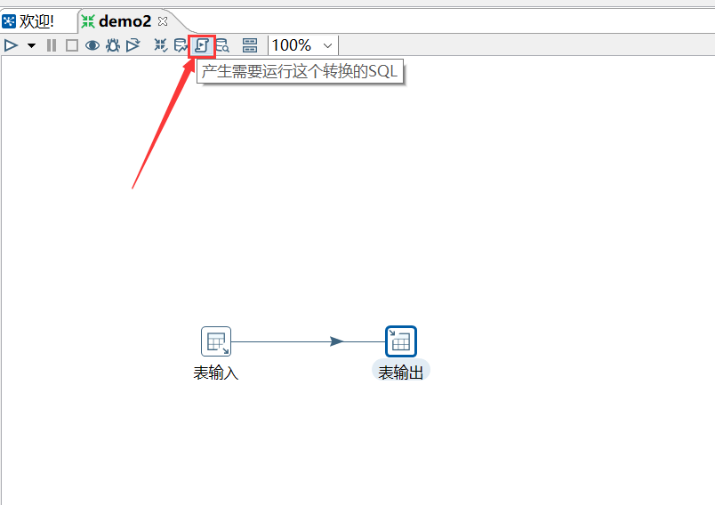  

8. 点击 “运行转换”，直接选择启动

   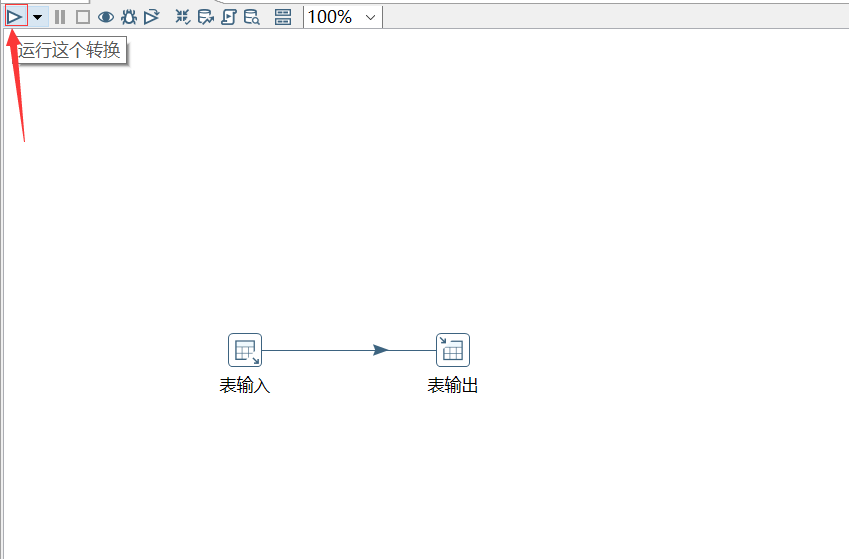

   之后就能看到执行结果   

   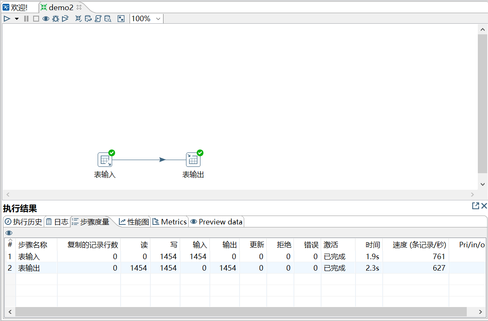   

   _这里仅是对数据进行迁移，主键、外键、关联信息不会迁移过去，需要后期去目标数据库配置。_   

9. 当出现数据中文乱码的时候

   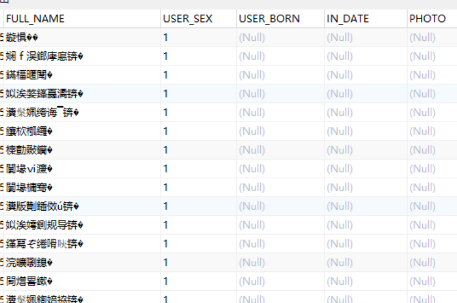   

   尝试去掉允许简易转换，再进行预览

   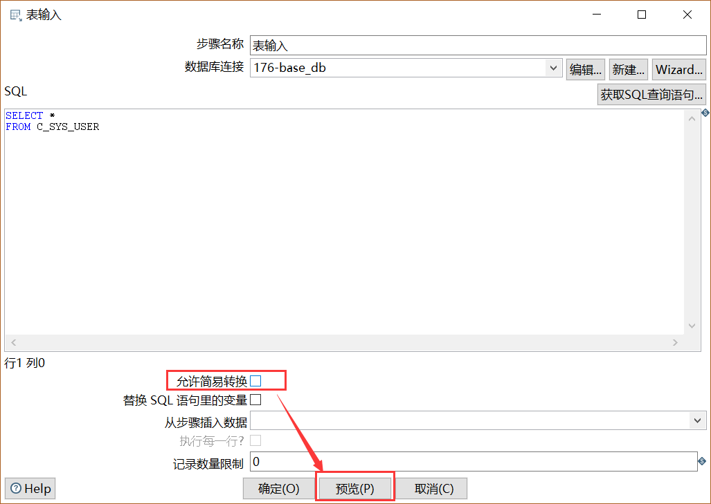   

   查看Oracle数据库的编码格式``select userenv('language') from dual; ``


### 多表数据备份   

当要对数据库多张表进行迁移操作的时候，Kettle提供自动生成流程图功能。

1. 选择**工具**-**向导**-**复制多表向导**   

2. 选择输入的数据库与输出的数据库

   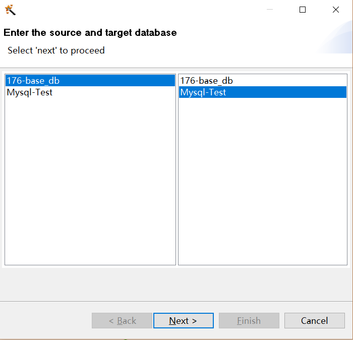   

3. 选择要复制的表

4. 选择Job File文件的存放路径,随意填写（因为可能会生成多个文件，建议放在文件夹内）

   

5. 点击Finish，等待约20s即可生成相应的迁移流程图，执行即可完成迁移

   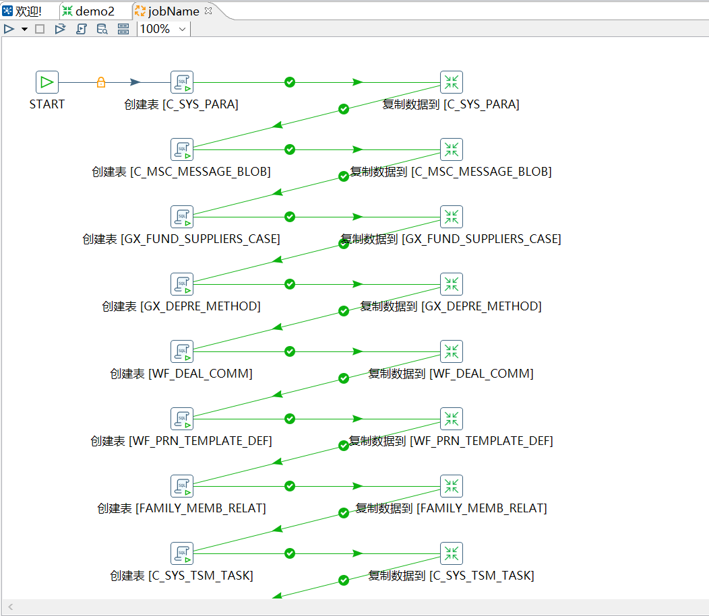  


### Kettle导入Excel文件

导入数据的步骤如下：

#### 1.使用Excel输入  

    

选择工作表

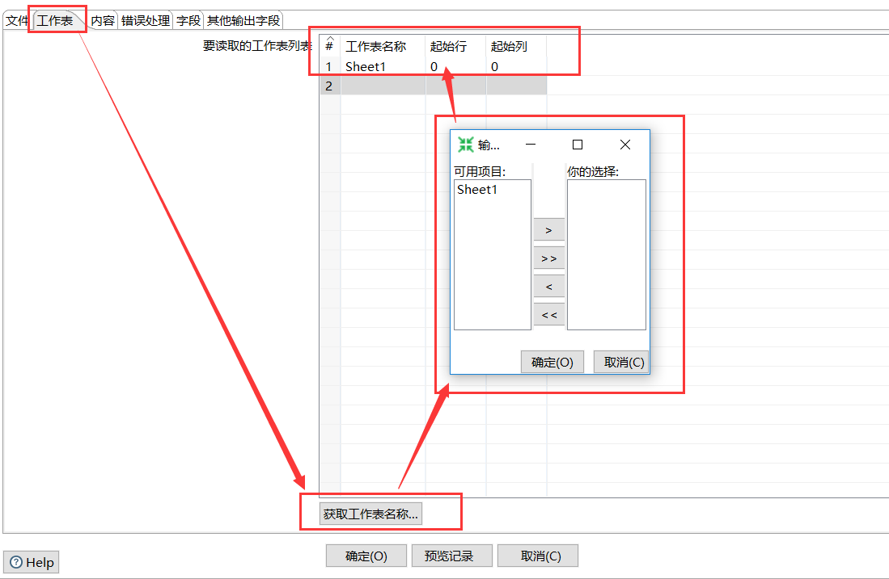  

获取头部数据字段

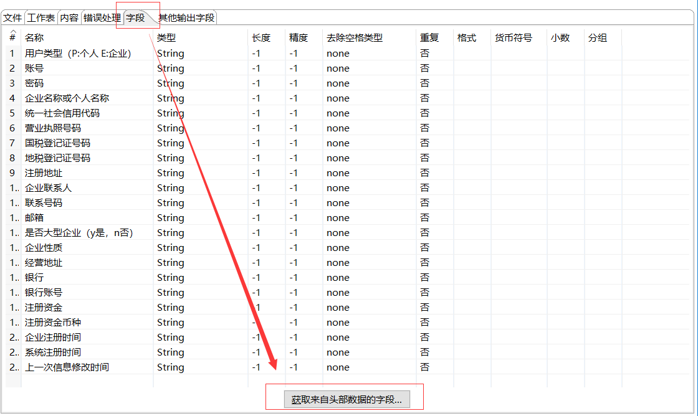  

#### 2.使用增加常量

  

#### 3.使用生成随机数

这里我们用的是UUID4

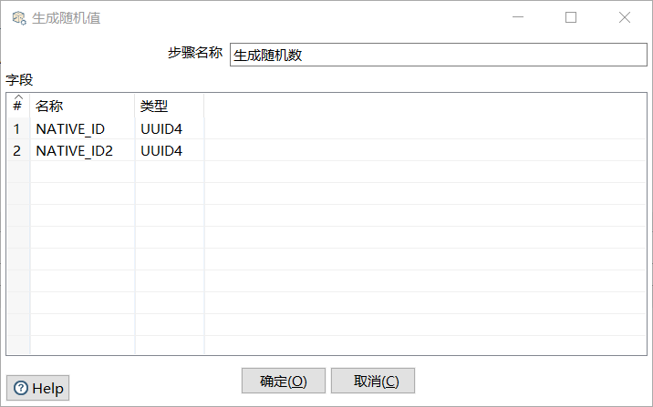  

#### 4.获取系统信息-生成日期     

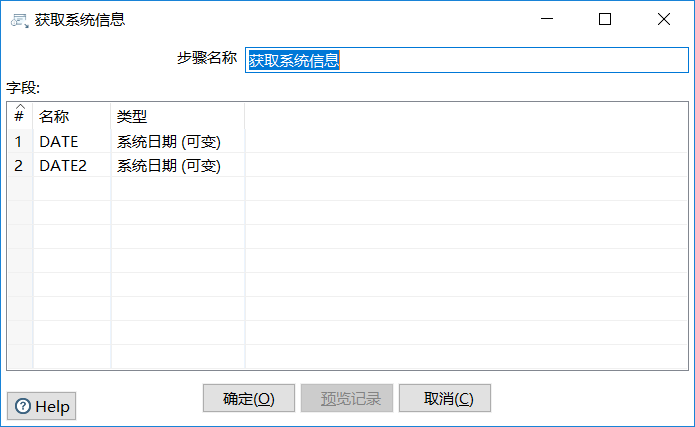  

#### 5.JavaScript代码-处理日期格式

```javascript
//Script here
var SYSTEM_DATE = date2str(DATE,"yyyy-MM-dd HH:mm:ss")

var SYSTEM_DATE2 = date2str(DATE2,"yyyy-MM-dd HH:mm:ss")
```

#### 6.插入/更新  操作数据   

编辑映射的字段，将输入的数据导入到目标数据表中

