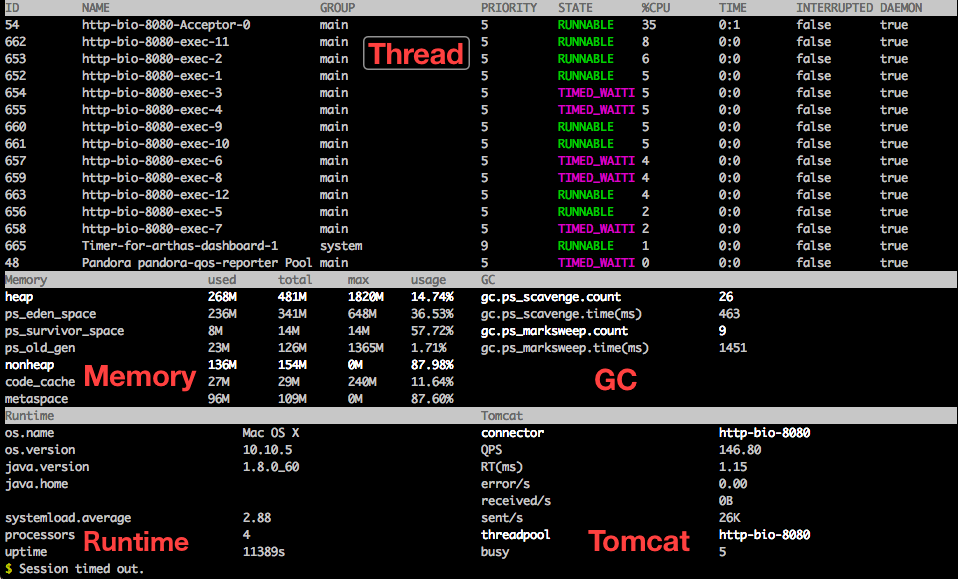
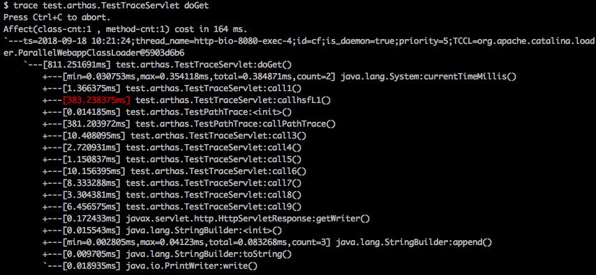

# arthas

arthas是阿里开源的java诊断工具（[地址](https://github.com/alibaba/arthas/blob/master/README_CN.md)）   

arthas在linux下的下载命令为：``wget https://alibaba.github.io/arthas/arthas-boot.jar``

## docker中使用arthas

1. 准备工作：在docker中启动arthas容器，并指定启动一个目标jar包

   ```text
   docker run --name arthas-demo -it hengyunabc/arthas:latest /bin/sh -c "java -jar /opt/arthas/arthas-demo.jar"
   ```

 2. 进入容器，并启动arthas

    ```text
    docker exec -it arthas-demo /bin/sh -c "java -jar /opt/arthas/arthas-boot.jar"
    ```

3. 选择要监控的进程，输入数字回车

## dashboard

``dashboard``：可以查看线程、内存等信息

  

## Thread

- ``thread (id)``：查看指定id的线程，可看到栈，线程状态
- ``thread -n 3``：可以查看最占CPU的3个线程，占用率与线程作用	

## jad

``jad (包.类)``：直接反编译指定类

## sc

``sc -d (包.类)``：可以查看已经加载类的位置与各种属性

```text
$ sc -d com.taobao.arthas.core.shell.system.impl.ProcessImpl
 class-info        com.taobao.arthas.core.shell.system.impl.ProcessImpl
 code-source       /opt/arthas/arthas-core.jar
 name              com.taobao.arthas.core.shell.system.impl.ProcessImpl
 isInterface       false
 isAnnotation      false
 isEnum            false
 isAnonymousClass  false
 isArray           false
 isLocalClass      false
 isMemberClass     false
 isPrimitive       false
 isSynthetic       false
 simple-name       ProcessImpl
 modifier          public
 annotation
 interfaces        com.taobao.arthas.core.shell.system.Process
 super-class       +-java.lang.Object
 class-loader      +-com.taobao.arthas.agent.ArthasClassloader@33159fe1
                     +-sun.misc.Launcher$ExtClassLoader@166787a6
 classLoaderHash   33159fe1

 class-info        com.taobao.arthas.core.shell.system.impl.ProcessImpl
 code-source       /opt/arthas/arthas-core.jar
 name              com.taobao.arthas.core.shell.system.impl.ProcessImpl
 isInterface       false
 isAnnotation      false
 isEnum            false
 isAnonymousClass  false
 isArray           false
 isLocalClass      false
 isMemberClass     false
 isPrimitive       false
 isSynthetic       false
 simple-name       ProcessImpl
 modifier          public
 annotation
 interfaces        com.taobao.arthas.core.shell.system.Process
 super-class       +-java.lang.Object
 class-loader      +-com.taobao.arthas.agent.ArthasClassloader@74df479a
                     +-sun.misc.Launcher$ExtClassLoader@166787a6
 classLoaderHash   74df479a
```

也可以用``sc -d *MathGame``进行模糊匹配

## stack

``test.arthas.TestStack doGet`` ：查看方法的堆栈调用信息

## Classloader

``classloader``：查看类加载器，加载类的数量，可以用来判断是否有类加载器泄漏。


---

下面是未尝试的命令：

## Trace 跟踪调用速度

观察方法执行时哪个子类调用比较慢：

  

## redefine重新加载类

是否属于热部署的一种

```
redefine /tmp/Test.class
redefine -c 327a647b /tmp/Test.class /tmp/Test\$Inner.class
```

## Watch

观察方法 `test.arthas.TestWatch#doGet` 执行的入参，仅当方法抛出异常时才输出。

```
$ watch test.arthas.TestWatch doGet {params[0], throwExp} -e
Press Ctrl+C to abort.
Affect(class-cnt:1 , method-cnt:1) cost in 65 ms.
ts=2018-09-18 10:26:28;result=@ArrayList[
    @RequestFacade[org.apache.catalina.connector.RequestFacade@79f922b2],
    @NullPointerException[java.lang.NullPointerException],
]
```

## Monitor

监控某个特殊方法的调用统计数据，包括总调用次数，平均rt，成功率等信息，每隔5秒输出一次。

```
$ monitor -c 5 org.apache.dubbo.demo.provider.DemoServiceImpl sayHello
Press Ctrl+C to abort.
Affect(class-cnt:1 , method-cnt:1) cost in 109 ms.
 timestamp            class                                           method    total  success  fail  avg-rt(ms)  fail-rate
----------------------------------------------------------------------------------------------------------------------------
 2018-09-20 09:45:32  org.apache.dubbo.demo.provider.DemoServiceImpl  sayHello  5      5        0     0.67        0.00%

 timestamp            class                                           method    total  success  fail  avg-rt(ms)  fail-rate
----------------------------------------------------------------------------------------------------------------------------
 2018-09-20 09:45:37  org.apache.dubbo.demo.provider.DemoServiceImpl  sayHello  5      5        0     1.00        0.00%

 timestamp            class                                           method    total  success  fail  avg-rt(ms)  fail-rate
----------------------------------------------------------------------------------------------------------------------------
 2018-09-20 09:45:42  org.apache.dubbo.demo.provider.DemoServiceImpl  sayHello  5      5        0     0.43        0.00%
```

## Time Tunnel(tt)

记录方法调用信息，支持事后查看方法调用的参数，返回值，抛出的异常等信息，仿佛穿越时空隧道回到调用现场一般。

```
$ tt -t org.apache.dubbo.demo.provider.DemoServiceImpl sayHello
Press Ctrl+C to abort.
Affect(class-cnt:1 , method-cnt:1) cost in 75 ms.
 INDEX   TIMESTAMP            COST(ms)  IS-RET  IS-EXP   OBJECT         CLASS                          METHOD
-------------------------------------------------------------------------------------------------------------------------------------
 1000    2018-09-20 09:54:10  1.971195  true    false    0x55965cca     DemoServiceImpl                sayHello
 1001    2018-09-20 09:54:11  0.215685  true    false    0x55965cca     DemoServiceImpl                sayHello
 1002    2018-09-20 09:54:12  0.236303  true    false    0x55965cca     DemoServiceImpl                sayHello
 1003    2018-09-20 09:54:13  0.159598  true    false    0x55965cca     DemoServiceImpl                sayHello
 1004    2018-09-20 09:54:14  0.201982  true    false    0x55965cca     DemoServiceImpl                sayHello
 1005    2018-09-20 09:54:15  0.214205  true    false    0x55965cca     DemoServiceImpl                sayHello
 1006    2018-09-20 09:54:16  0.241863  true    false    0x55965cca     DemoServiceImpl                sayHello
 1007    2018-09-20 09:54:17  0.305747  true    false    0x55965cca     DemoServiceImpl                sayHello
 1008    2018-09-20 09:54:18  0.18468   true    false    0x55965cca     DemoServiceImpl                sayHello
```


更多记录：https://alibaba.github.io/arthas/arthas-tutorials?language=cn&id=arthas-advanced