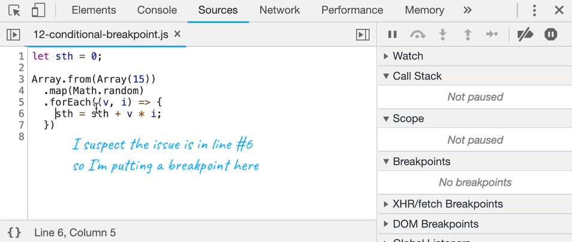

# chrome

## Command

像idea中的find action，DevTools也有自己的Command，打开方式为``[Ctrl]+[Shift]+[P]``

1. 全屏截图

   Capture full size screenshot：通过这条命令可以将整个页面（包括滚动条下方的页面截取成一张长图）  

2. 节点截图

   Capture node screenshot：选中节点之后执行这条命令，可以单独截取该节点

## 代码块

在Console面板可以执行js代码。如果我们要将DevTools当脚本使用，可以将Js代码保存起来：

1. Scources-Snippets面板，new snippet即可新建保存代码
2. 通过``[ctrl] + [enter]``执行或者Command面板输入``!XXX``，搜索js代码执行

## $标识符

### $0

当我们选中节点元素，在Console中输入``$0``,就能获取到当前节点的引用。

而``$1``就是上一个选中节点，``$2``则是上上个选中节点，以此类推。

获取到节点之后可以做一些测试操作，例如：``$0.appendChild($1)``  

### $

``Array.from(document.querySelectorAll('div')) === $$('div')``，他返回的将是一个节点的数组。而内容则相当于一个选择器，支持多种方式筛选``$$('div.title')``  

### $i

$i是用来运行npm插件的，需要配合[Console Importer](https://chrome.google.com/webstore/detail/console-importer/hgajpakhafplebkdljleajgbpdmplhie/related) 插件，即可测试npm库。

## 断点

### 条件断点   

可以用在多个循环中，调试某个循环

  

### 插入调试信息

在源码中可以添加 `console.log` / `console.table` / `console.time` 查看调试信息，也可以通过条件断点添加，方法如下

  

  

[https://juejin.im/book/5c526902e51d4543805ef35e/section/5c526985518825242165f615](https://juejin.im/book/5c526902e51d4543805ef35e/section/5c526985518825242165f615)

