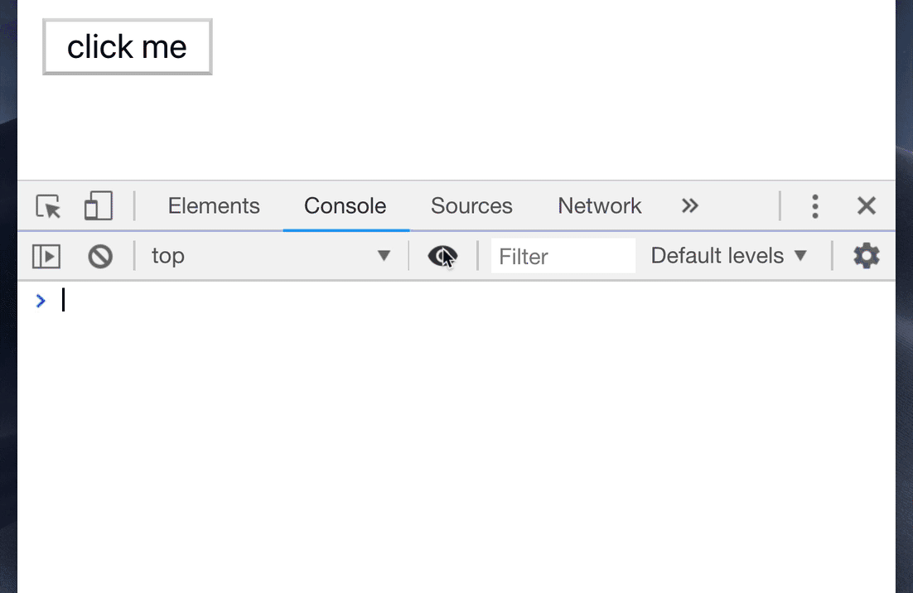

# chrome

## Command

像idea中的find action，DevTools也有自己的Command，打开方式为``[Ctrl]+[Shift]+[P]``

1. 全屏截图

   Capture full size screenshot：通过这条命令可以将整个页面（包括滚动条下方的页面截取成一张长图）  

2. 节点截图

   Capture node screenshot：选中节点之后执行这条命令，可以单独截取该节点

## snippet代码块

在Console面板可以执行js代码。如果我们要将DevTools当脚本使用，可以将Js代码保存起来：

1. Scources-Snippets面板，new snippet即可新建保存代码
2. 通过``[ctrl] + [enter]``执行或者Command面板输入``!XXX``，搜索js代码执行

## Console控制台

### $标识符

#### $0

当我们选中节点元素，在Console中输入``$0``,就能获取到当前节点的引用。

而``$1``就是上一个选中节点，``$2``则是上上个选中节点，以此类推。

获取到节点之后可以做一些测试操作，例如：``$0.appendChild($1)``  

#### $

``Array.from(document.querySelectorAll('div')) === $$('div')``，他返回的将是一个节点的数组。而内容则相当于一个选择器，支持多种方式筛选``$$('div.title')``  

#### $i

$i是用来运行npm插件的，需要配合[Console Importer](https://chrome.google.com/webstore/detail/console-importer/hgajpakhafplebkdljleajgbpdmplhie/related) 插件，即可测试npm库。

### 断点

#### 条件断点

可以用在多个循环中，调试某个循环

  

#### 插入调试信息

在源码中可以添加 `console.log` / `console.table` / `console.time` 查看调试信息，也可以通过条件断点添加，方法如下

  

### 对象

在控制台对对象打印可以使用``queryObject(Person)``,保存成变量之后通过``console.table(temp2)``可以将变量列出

     

#### console打印对象  

可以用``console.log({值1,值2...})``打印对象，还可以用``console.table(对象)``

如果打印的列太多，也可以通过以下方法进行筛选：

  

可以两者结合，组成``console.table({值1，值2...})``  

### 时间戳

如果要查看方式的时间间隔，可以用time方法

- `console.time()` — 开启一个计时器
- `console.timeEnd()` — 结束计时并且将结果在 `console` 中打印出来

### JS代码调试

点击👁图标，可以实时插入任何js代码，并且不断执行

### Network

Network面板使用的小技巧，可以查看调用的对堆栈：

  

可以过滤请求的属性，例如`method` 或者 `mime-type` :

  

## DOM节点

### Console查看DOM

通过``console.log($('选择器'))``可以将指定节点的内容打印出来，但是看不到它的属性等信息。

通过``console.dir``就可以查看到节点相关信息了  

### ElementsDOM断点

如果DOM节点被JS做了修改，可以通过DOM断点进行监听

- 右键DOM元素

- 选择 `subtree modifications` :监听任何它内部的节点被 `移除` 或者 `添加`的事件
- 选择 `attribute modifications` :监听任何当前选中的节点被 `添加`，`移除` 或者 `被修改值`的事件

_查看文章：[你不知道的 Chrome 调试技巧](https://juejin.im/book/5c526902e51d4543805ef35e/section)_  