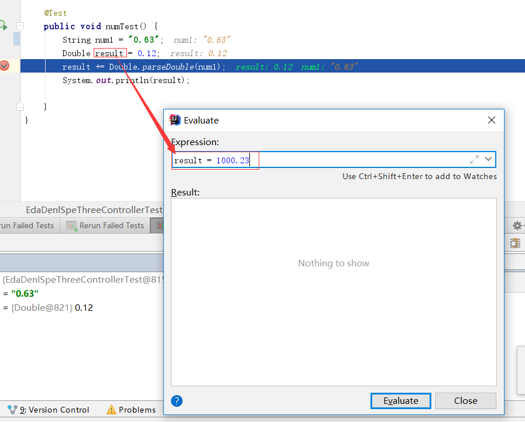
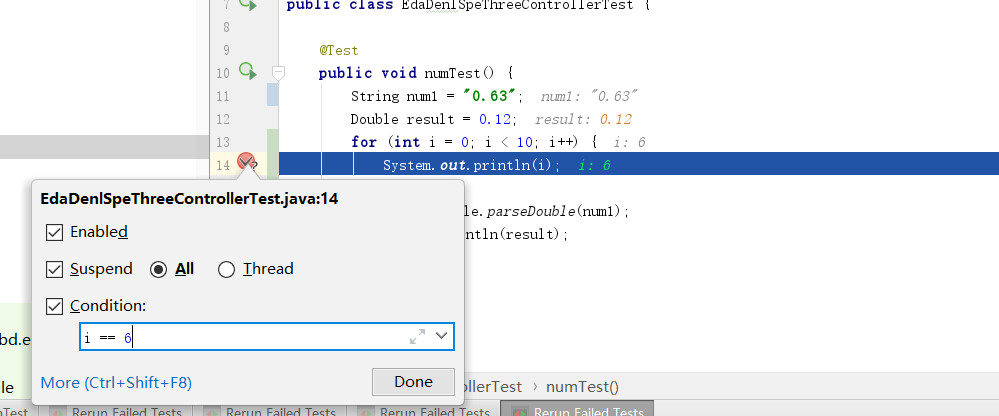
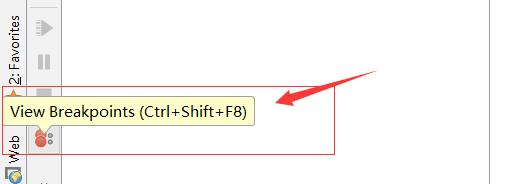
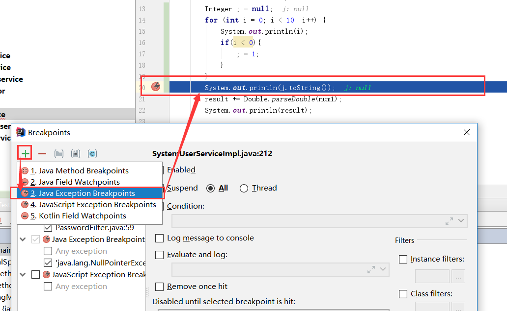
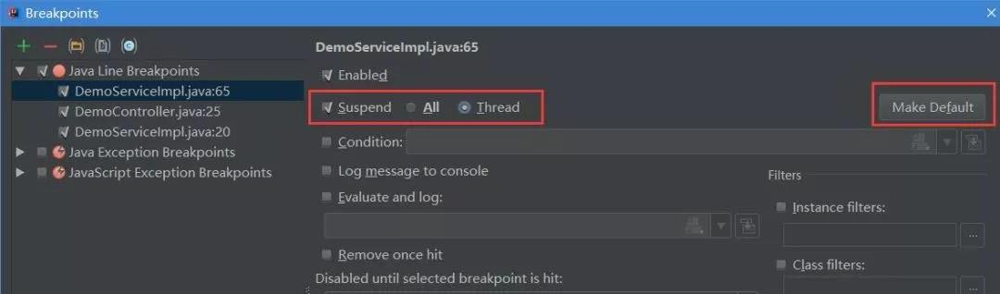
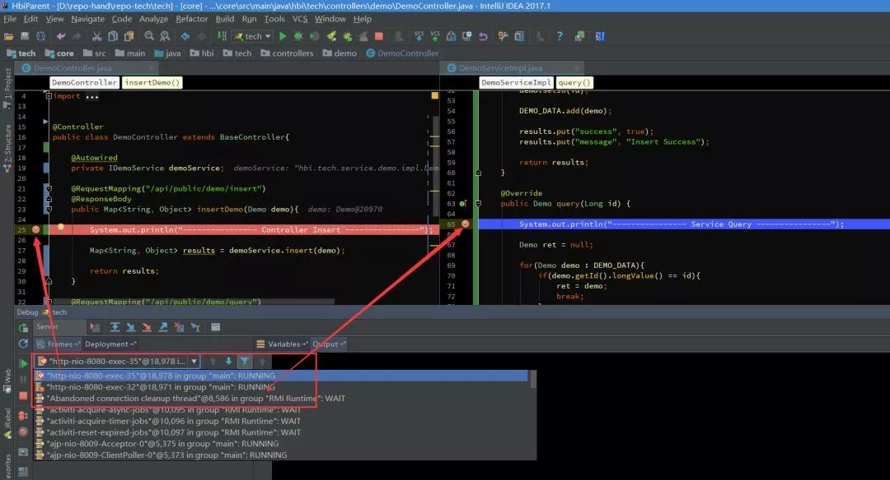

# IDEA中Debug

### 调试控制按钮

  

- 1Rerun 'xxxx'：重新运行程序
- 2Return failed Tests：在Debug过程中更新程序修改内容  
- 4resume program(F9)：重新启动程序（在断点继续）
- 6Stop 'xxx' (Ctrl + F2)：连续按两下，关闭程序
- 7View Breakpoints (Ctrl + Shift + F8)：查看所有断点   
- 8Mute Breakpoints：断点失效，可以跳过断点运行

### 调试步骤按钮

   

- 1Show Execution Point (Alt + F10)：返回断点位置。如果光标在其它行，点击这个按钮可跳转到当前代码执行的行。
- 2Step Over (F8)：步过，一行一行地往下走，有方法不会进入方法。   
- 3Step Into (F7)：步入，有方法会进入方法内部，只进入自定义方法内，不会进入官方类库的方法。
- 4Force Step Into (Alt + Shift + F7)：强制步入，能进入任何方法，查看底层源码常用。
- 5Step Out (Shift + F8)：步出，从步入的方法内退出到方法调用处，此时方法已执行完毕，只是还没有完成赋值。
- 6Drop Frame：断点回退。所谓的断点针对的是方法，当进入方法的里层时，按Drop Frame可以回退到上一层方法中。（而并非回退到之前的状态）
- 7Run to Cursor (Alt + F9)：运行到光标处

- Evaluate Expression：计算表达式，可以在运行过程中对赋值进行修改

    

### 断点条件   

在断点上右键，设置断点条件，只有符合条件才会进入断点。

  

### 异常断点   

点击``View Breakpoints``进入断点面板

选择添加异常的类，就可以断点在进入异常的方法上

  

### 多线程调试

当要使用多线程调试的时候，为当前断点选择多线程

通过Frames的下拉列表，可以切换当前的线程

  